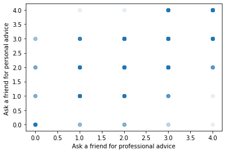

# Investigate the Data

Welcome to the cumulative project on clustering algorithms! In this project, we will be investigating the way people think about masculinity by applying the KMeans algorithm to data from  <a href="https://fivethirtyeight.com/" target = "_blank">FiveThirtyEight</a>. FiveThirtyEight is a popular website known for their use of statistical analysis in many of their stories.

To begin, take a look at `masculinity-survey.pdf`. FiveThirtyEight and WNYC studios used this survey to get their male readers' thoughts on masculinity. After looking through some of the questions asked, take a look at FiveThirtyEight's article <a href="https://fivethirtyeight.com/features/what-do-men-think-it-means-to-be-a-man/" target = "_blank">What Do Men Think It Means To Be A Man?</a> to see their major takeaways. We're going to try to find more insights using machine learning.

In the code block below, we've loaded `masculinity.csv` into a DataFrame named `survey`. This file contains the raw responses to the masculinity survey. Let's start getting a sense of how this data is structured. Try to answer these questions using your Pandas knowledge:
* What are the names of the columns? How do those columns relate to the questions in the PDF?
* How many rows are there?
* How is a question with multiple parts, like question 7, represented in the DataFrame?
* How many people said they often ask a friend for professional advice? This is the first sub-question in question 7.

To answer that last question, use the `value_counts()` function. For example, `df["col_a"].value_counts()` gives you a nice summary of the values found in `"col_a"` of the DataFrame `df`.

You may also want to print `survey.head()` to get a sense of all of the columns.


```python
import pandas as pd

survey = pd.read_csv("masculinity.csv")

print(survey.columns)
print(survey.count())
for i in range(1,10):
    print(survey['q0007_000'+str(i)].value_counts())
print(survey['q0007_0010'].value_counts())
print(survey['q0007_0011'].value_counts())
survey.head()
```

    Index(['Unnamed: 0', 'StartDate', 'EndDate', 'q0001', 'q0002', 'q0004_0001',
           'q0004_0002', 'q0004_0003', 'q0004_0004', 'q0004_0005', 'q0004_0006',
           'q0005', 'q0007_0001', 'q0007_0002', 'q0007_0003', 'q0007_0004',
           'q0007_0005', 'q0007_0006', 'q0007_0007', 'q0007_0008', 'q0007_0009',
           'q0007_0010', 'q0007_0011', 'q0008_0001', 'q0008_0002', 'q0008_0003',
           'q0008_0004', 'q0008_0005', 'q0008_0006', 'q0008_0007', 'q0008_0008',
           'q0008_0009', 'q0008_0010', 'q0008_0011', 'q0008_0012', 'q0009',
           'q0010_0001', 'q0010_0002', 'q0010_0003', 'q0010_0004', 'q0010_0005',
           'q0010_0006', 'q0010_0007', 'q0010_0008', 'q0011_0001', 'q0011_0002',
           'q0011_0003', 'q0011_0004', 'q0011_0005', 'q0012_0001', 'q0012_0002',
           'q0012_0003', 'q0012_0004', 'q0012_0005', 'q0012_0006', 'q0012_0007',
           'q0013', 'q0014', 'q0015', 'q0017', 'q0018', 'q0019_0001', 'q0019_0002',
           'q0019_0003', 'q0019_0004', 'q0019_0005', 'q0019_0006', 'q0019_0007',
           'q0020_0001', 'q0020_0002', 'q0020_0003', 'q0020_0004', 'q0020_0005',
           'q0020_0006', 'q0021_0001', 'q0021_0002', 'q0021_0003', 'q0021_0004',
           'q0022', 'q0024', 'q0025_0001', 'q0025_0002', 'q0025_0003', 'q0026',
           'q0028', 'q0029', 'q0030', 'q0034', 'q0035', 'q0036', 'race2',
           'racethn4', 'educ3', 'educ4', 'age3', 'kids', 'orientation', 'weight'],
          dtype='object')
    Unnamed: 0     1189
    StartDate      1189
    EndDate        1189
    q0001          1189
    q0002          1189
                   ... 
    educ4          1188
    age3           1188
    kids           1183
    orientation    1188
    weight         1188
    Length: 98, dtype: int64
    Sometimes                    537
    Rarely                       324
    Often                        142
    Never, but open to it        123
    Never, and not open to it     53
    No answer                     10
    Name: q0007_0001, dtype: int64
    Sometimes                    514
    Rarely                       387
    Often                        123
    Never, but open to it        101
    Never, and not open to it     50
    No answer                     14
    Name: q0007_0002, dtype: int64
    Sometimes                    364
    Rarely                       339
    Never, and not open to it    224
    Often                        166
    Never, but open to it         85
    No answer                     11
    Name: q0007_0003, dtype: int64
    Rarely                       505
    Sometimes                    371
    Never, but open to it        121
    Never, and not open to it     78
    No answer                     71
    Often                         43
    Name: q0007_0004, dtype: int64
    Never, and not open to it    710
    Never, but open to it        228
    Rarely                       217
    Sometimes                     22
    Often                          7
    No answer                      5
    Name: q0007_0005, dtype: int64
    Often                        427
    Sometimes                    384
    Rarely                       155
    Never, and not open to it    102
    Never, but open to it         91
    No answer                     30
    Name: q0007_0006, dtype: int64
    Never, and not open to it    1001
    Never, but open to it          60
    Sometimes                      41
    Often                          39
    Rarely                         31
    No answer                      17
    Name: q0007_0007, dtype: int64
    Often                        482
    Sometimes                    344
    Rarely                       216
    Never, and not open to it     93
    Never, but open to it         43
    No answer                     11
    Name: q0007_0008, dtype: int64
    Sometimes                    353
    Rarely                       316
    Often                        296
    Never, but open to it         95
    Never, and not open to it     95
    No answer                     34
    Name: q0007_0009, dtype: int64
    Never, but open to it        464
    Never, and not open to it    355
    Rarely                       189
    Sometimes                     97
    Often                         58
    No answer                     26
    Name: q0007_0010, dtype: int64
    Rarely                       456
    Sometimes                    339
    Never, and not open to it    187
    Often                        111
    Never, but open to it         75
    No answer                     21
    Name: q0007_0011, dtype: int64
    


<div>
<style scoped>
    .dataframe tbody tr th:only-of-type {
        vertical-align: middle;
    }

    .dataframe tbody tr th {
        vertical-align: top;
    }

    .dataframe thead th {
        text-align: right;
    }
</style>
<table border="1" class="dataframe">
  <thead>
    <tr style="text-align: right;">
      <th></th>
      <th>Unnamed: 0</th>
      <th>StartDate</th>
      <th>EndDate</th>
      <th>q0001</th>
      <th>q0002</th>
      <th>q0004_0001</th>
      <th>q0004_0002</th>
      <th>q0004_0003</th>
      <th>q0004_0004</th>
      <th>q0004_0005</th>
      <th>...</th>
      <th>q0035</th>
      <th>q0036</th>
      <th>race2</th>
      <th>racethn4</th>
      <th>educ3</th>
      <th>educ4</th>
      <th>age3</th>
      <th>kids</th>
      <th>orientation</th>
      <th>weight</th>
    </tr>
  </thead>
  <tbody>
    <tr>
      <th>0</th>
      <td>1</td>
      <td>5/10/18 4:01</td>
      <td>5/10/18 4:06</td>
      <td>Somewhat masculine</td>
      <td>Somewhat important</td>
      <td>Not selected</td>
      <td>Not selected</td>
      <td>Not selected</td>
      <td>Pop culture</td>
      <td>Not selected</td>
      <td>...</td>
      <td>Middle Atlantic</td>
      <td>Windows Desktop / Laptop</td>
      <td>Non-white</td>
      <td>Hispanic</td>
      <td>College or more</td>
      <td>College or more</td>
      <td>35 - 64</td>
      <td>No children</td>
      <td>Gay/Bisexual</td>
      <td>1.714026</td>
    </tr>
    <tr>
      <th>1</th>
      <td>2</td>
      <td>5/10/18 6:30</td>
      <td>5/10/18 6:53</td>
      <td>Somewhat masculine</td>
      <td>Somewhat important</td>
      <td>Father or father figure(s)</td>
      <td>Not selected</td>
      <td>Not selected</td>
      <td>Not selected</td>
      <td>Not selected</td>
      <td>...</td>
      <td>East North Central</td>
      <td>iOS Phone / Tablet</td>
      <td>White</td>
      <td>White</td>
      <td>Some college</td>
      <td>Some college</td>
      <td>65 and up</td>
      <td>Has children</td>
      <td>Straight</td>
      <td>1.247120</td>
    </tr>
    <tr>
      <th>2</th>
      <td>3</td>
      <td>5/10/18 7:02</td>
      <td>5/10/18 7:09</td>
      <td>Very masculine</td>
      <td>Not too important</td>
      <td>Father or father figure(s)</td>
      <td>Not selected</td>
      <td>Not selected</td>
      <td>Not selected</td>
      <td>Not selected</td>
      <td>...</td>
      <td>East North Central</td>
      <td>Windows Desktop / Laptop</td>
      <td>White</td>
      <td>White</td>
      <td>College or more</td>
      <td>College or more</td>
      <td>35 - 64</td>
      <td>Has children</td>
      <td>Straight</td>
      <td>0.515746</td>
    </tr>
    <tr>
      <th>3</th>
      <td>4</td>
      <td>5/10/18 7:27</td>
      <td>5/10/18 7:31</td>
      <td>Very masculine</td>
      <td>Not too important</td>
      <td>Father or father figure(s)</td>
      <td>Mother or mother figure(s)</td>
      <td>Other family members</td>
      <td>Not selected</td>
      <td>Not selected</td>
      <td>...</td>
      <td>East North Central</td>
      <td>Windows Desktop / Laptop</td>
      <td>White</td>
      <td>White</td>
      <td>Some college</td>
      <td>Some college</td>
      <td>65 and up</td>
      <td>Has children</td>
      <td>No answer</td>
      <td>0.600640</td>
    </tr>
    <tr>
      <th>4</th>
      <td>5</td>
      <td>5/10/18 7:35</td>
      <td>5/10/18 7:42</td>
      <td>Very masculine</td>
      <td>Very important</td>
      <td>Not selected</td>
      <td>Not selected</td>
      <td>Other family members</td>
      <td>Not selected</td>
      <td>Not selected</td>
      <td>...</td>
      <td>East North Central</td>
      <td>Windows Desktop / Laptop</td>
      <td>White</td>
      <td>White</td>
      <td>College or more</td>
      <td>College or more</td>
      <td>35 - 64</td>
      <td>No children</td>
      <td>Straight</td>
      <td>1.033400</td>
    </tr>
  </tbody>
</table>
<p>5 rows × 98 columns</p>
</div>


# Mapping the Data

In order for us to start thinking about using the KMeans algorithm with this data, we need to first figure out how to turn these responses into numerical data. Let's once again consider question 7. We can't cluster the data using the phrases `"Often"` or `"Rarely"`, but we can turn those phrases into numbers. For example, we could map the data in the following way: 
* `"Often"` -> `4`
* `"Sometimes"` ->  `3`
* `"Rarely"` -> `2` 
* `"Never, but open to it"` -> `1`
* `"Never, and not open to it"` -> `0`.

Note that it's important that these responses are somewhat linear. `"Often"` is at one end of the spectrum with `"Never, and not open to it"` at the other. The other values fall in sequence between the two. You could perform a similar mapping for the `"educ4"` responses (question 29), but there isn't an obvious linear progression in the `"racethn4"` responses (question 28).

In order to do this transformation, use the `map()` function. `map()` takes a dictionary as a parameter. For example, the following line of code would turn all the `"A"`s into `1`s and all the `"B"`s into `2`s in the column `"col_one"`.

```py
df["col_one"] = df["col_one"].map({"A": 1, "B": 2})
```

We've given you a list of the columns that should be mapped. Loop through the values of the list and map each column using the mapping described above.

Be careful of your spelling! Punctuation and whitespace is important. Take a look at the `value_counts()` of one of these columns to see if the mapping worked.


```python
cols_to_map = ["q0007_0001", "q0007_0002", "q0007_0003", "q0007_0004",
       "q0007_0005", "q0007_0006", "q0007_0007", "q0007_0008", "q0007_0009",
       "q0007_0010", "q0007_0011"]
for col_to_map in cols_to_map:
    survey[col_to_map] = survey[col_to_map].map({"Often": 4, "Sometimes": 3, "Rarely": 2, "Never, but open to it": 1, "Never, and not open to it": 0})
print(survey["q0007_0011"].value_counts())
```

    2.0    456
    3.0    339
    0.0    187
    4.0    111
    1.0     75
    Name: q0007_0011, dtype: int64
    

# Plotting the Data

We now have 11 different features that we could use in our KMeans algorithm. Before we jump into clustering, let's graph some of these features on a 2D graph. Call `plt.scatter` using `survey["q0007_0001"]` and `survey["q0007_0002"]` as parameters. Include `alpha = 0.1`. We want to include `alpha` because many of the data points will be on top of each other. Adding `alpha` will make the points appear more solid if there are many stacked on top of each other.

Include axis labels on your graph. The x-axis corresponds with the first column you gave the `scatter()` function. So in this case, it corresponds to the question about asking a friend for professional advice.

Does it make sense that there are few points in the top left and bottom right corners of the graph? Why? Try graphing other dimensions against each other. Are there any combinations that give you surprising results?


```python
from matplotlib import pyplot as plt
plt.scatter(survey["q0007_0001"], survey["q0007_0002"], alpha = 0.1)
plt.xlabel("Ask a friend for professional advice")
plt.ylabel("Ask a friend for personal advice ")
plt.show
```


    <function matplotlib.pyplot.show(*args, **kw)>





# Build the KMeans Model

It's now time to start clustering! There are so many interesting questions we could ask about this data. Let's start by seeing if clusters form based on traditionally masculine concepts. 

Take a look at the first four sub-questions in question 7. Those four activities aren't necessarily seen as traditionally masculine. On the other hand, sub-questions 5, 8, and 9 are often seen as very masculine activities. What would happen if we found 2 clusters based on those 7 questions? Would we find clusters that represent traditionally feminine and traditionally masculine people? Let's find out.

We need to first drop all of the rows that contain a `NaN` value in any of the columns we're interested in. Create a new variable named `rows_to_cluster` and set it equal to the result of calling `dropna` on `survey`. `dropna` should have a parameter `subset` equal to a list of the 7 columns we want. If you don't include `subset`, the function will drop all rows that have an `NaN` in *any* column. This would drop almost all the rows in the dataframe!

Create a `KMeans` object named `classifier` where `n_clusters = 2`. Call `classifier`'s `.fit()` method. The parameter of `.fit()` should be the 7 columns we're interested in. For example, the following line of code will fit the model based on the columns `"col_one"` and `"col_two"` of the Dataframe `df`. 

```py
classifier.fit(df[["col_one", "col_two"]])
```

Make sure to only include the columns that you want to train off of. Make sure to use `rows_to_cluster` rather than `survey` to avoid including those `NaN`s!


After fitting your model, print out the model's `cluster_centers_`.


```python
from sklearn.cluster import KMeans

rows_to_cluster = survey.dropna(subset=["q0007_0001", "q0007_0002", "q0007_0003", "q0007_0004", "q0007_0005", "q0007_0008", "q0007_0009"])
classifier = KMeans(n_clusters = 2)
classifier.fit(rows_to_cluster[["q0007_0001", "q0007_0002", "q0007_0003", "q0007_0004", "q0007_0005", "q0007_0008", "q0007_0009"]])
print(classifier.cluster_centers_)
```

    [[2.84548105 2.81632653 2.84110787 2.39941691 0.69387755 3.06997085
      2.90087464]
     [1.87830688 1.84391534 0.85185185 1.72486772 0.57142857 2.64021164
      1.97089947]]
    

# Separate the Cluster Members

When we look at the two clusters, the first four numbers represent the traditionally feminine activities and the last three represent the traditionally masculine activities. If the data points separated into a feminine cluser and a masculine cluseter, we would expect to see one cluster to have high values for the first four numbers and the other cluster to have high values for the last three numbers.

Instead, the first cluster has a higher value in every feature. Since a higher number means the person was more likely to "often" do something, the clusters seem to represent "people who do things" and "people who don't do things".

We might be able to find out more information about these clusters by looking at the specific members of each cluster. Print `classifier.labels_`. This list shows which cluster every row in the DataFrame corresponds to.

For example,  if `classifier.labels_` was `[1, 0 ,1]`, then the first row in the DataFrame would be in cluster one, the second row would be in cluster 0, and the third row would be in cluster one. A row represents one persons answers to every question in the survey.

Create two new empty lists named `cluster_zero_indices` and `cluster_one_indices`. Loop through `classifier.labels_` and whenever a label is `0` add that index to `cluster_zero_indices`. Do the same whenever a label is a `1`.

Print `cluster_zero_indices`


```python
print(classifier.labels_)
cluster_zero_indices = []
cluster_one_indices = []
for i in range(len(classifier.labels_)):
    if classifier.labels_[i] == 0:
        cluster_zero_indices.append(i)
    if classifier.labels_[i]==1:
        cluster_one_indices.append(i)
print(cluster_zero_indices)
```

    [0 1 0 ... 1 1 1]
    [0, 2, 3, 5, 8, 11, 13, 15, 16, 20, 21, 22, 23, 25, 26, 27, 28, 30, 31, 32, 33, 34, 36, 37, 38, 40, 41, 43, 44, 45, 46, 47, 48, 50, 56, 59, 60, 61, 64, 67, 68, 69, 70, 71, 72, 73, 74, 76, 77, 80, 81, 83, 85, 91, 93, 96, 99, 100, 102, 103, 104, 105, 108, 110, 111, 112, 114, 115, 120, 121, 122, 124, 125, 126, 127, 133, 135, 136, 137, 138, 140, 141, 144, 145, 146, 147, 148, 149, 150, 151, 152, 153, 155, 156, 157, 158, 159, 160, 161, 162, 163, 164, 165, 166, 167, 168, 169, 170, 171, 173, 174, 177, 182, 183, 185, 186, 188, 190, 191, 192, 193, 194, 197, 200, 202, 203, 204, 205, 206, 207, 208, 210, 211, 213, 214, 215, 216, 217, 218, 219, 220, 221, 223, 224, 225, 226, 227, 228, 232, 234, 235, 238, 239, 242, 243, 244, 245, 246, 251, 252, 253, 254, 255, 257, 258, 259, 262, 265, 266, 267, 268, 269, 270, 271, 273, 274, 276, 277, 278, 279, 280, 282, 285, 287, 289, 290, 292, 293, 294, 295, 298, 302, 303, 304, 306, 307, 308, 309, 312, 313, 314, 315, 316, 317, 318, 319, 320, 321, 322, 323, 324, 326, 327, 329, 330, 332, 333, 334, 335, 338, 339, 342, 344, 345, 346, 348, 349, 352, 354, 355, 356, 357, 358, 359, 360, 362, 363, 364, 365, 366, 368, 370, 371, 372, 373, 374, 375, 376, 379, 380, 381, 382, 383, 384, 385, 386, 387, 388, 389, 395, 400, 401, 402, 403, 404, 405, 406, 407, 408, 413, 414, 416, 420, 421, 422, 423, 424, 426, 427, 430, 431, 433, 434, 435, 436, 437, 438, 439, 440, 441, 442, 443, 444, 445, 446, 447, 448, 450, 451, 452, 453, 456, 458, 460, 462, 464, 465, 466, 467, 469, 472, 473, 474, 475, 479, 480, 481, 482, 483, 485, 486, 487, 488, 491, 492, 495, 497, 500, 501, 503, 504, 505, 506, 507, 511, 512, 513, 514, 517, 518, 519, 520, 522, 524, 527, 528, 530, 532, 534, 535, 536, 537, 538, 539, 540, 541, 543, 544, 545, 547, 548, 550, 551, 552, 553, 554, 557, 558, 561, 565, 568, 569, 571, 572, 573, 574, 575, 576, 578, 581, 582, 583, 584, 586, 587, 590, 591, 594, 595, 596, 597, 598, 600, 601, 602, 604, 605, 606, 607, 608, 609, 611, 612, 613, 614, 615, 618, 621, 623, 624, 627, 628, 630, 632, 633, 635, 640, 641, 642, 643, 644, 645, 646, 647, 648, 650, 652, 653, 657, 658, 660, 661, 663, 664, 665, 666, 667, 668, 670, 671, 672, 673, 674, 675, 676, 678, 679, 680, 682, 684, 688, 689, 690, 693, 694, 695, 698, 699, 700, 701, 703, 704, 705, 706, 707, 708, 709, 711, 712, 713, 714, 715, 716, 717, 724, 725, 727, 729, 731, 732, 733, 734, 735, 737, 739, 740, 742, 743, 746, 747, 752, 753, 754, 755, 756, 757, 760, 761, 763, 764, 765, 767, 770, 771, 773, 774, 779, 780, 781, 784, 785, 786, 791, 793, 796, 798, 802, 804, 806, 807, 808, 809, 811, 812, 813, 815, 816, 817, 818, 819, 820, 822, 823, 824, 825, 828, 829, 830, 832, 833, 834, 835, 836, 838, 840, 841, 842, 844, 845, 846, 847, 850, 851, 852, 854, 855, 857, 859, 861, 862, 863, 864, 865, 866, 867, 869, 870, 873, 876, 877, 878, 881, 885, 887, 888, 889, 890, 891, 893, 899, 903, 905, 906, 907, 908, 909, 910, 912, 913, 915, 916, 917, 920, 921, 925, 926, 927, 928, 930, 931, 933, 934, 935, 937, 938, 940, 941, 942, 944, 945, 946, 947, 949, 950, 951, 952, 953, 955, 956, 957, 959, 960, 964, 965, 966, 969, 972, 973, 975, 976, 977, 979, 980, 981, 983, 984, 986, 988, 990, 992, 994, 995, 996, 997, 999, 1001, 1002, 1004, 1005, 1006, 1008, 1009, 1010, 1012, 1015, 1017, 1018, 1019, 1020, 1021, 1022, 1023, 1024, 1026, 1027, 1028, 1029, 1030, 1031, 1032, 1033, 1034, 1035, 1040, 1041, 1043, 1044, 1047, 1049, 1051, 1052, 1053, 1056, 1058, 1059, 1060]
    

# Investigate the Cluster Members

Now that we have the indices for each cluster, let's look at some stats about these two clusters. You can get the rows of the DataFrame that correspond to cluster zero by doing the following:

```py
cluster_zero_df = rows_to_cluster.iloc[cluster_zero_indices]
```

Do the same for `cluster_one_df`.

Finally, let's look at some information about these two clusters. Print the `value_counts()` of the `educ4` column of each cluster. What do you notice? Try looking at different columns. For example, are the people in cluster zero significantly older than those in cluster one? You can look at the `age3` column to see.

If you divide the result of `value_counts()` by the size of the cluster, you get the percentage of people in each category rather than the total number. This will make it easier to compare the two clusters.


```python
cluster_zero_df = rows_to_cluster.iloc[cluster_zero_indices]
cluster_one_df = rows_to_cluster.iloc[cluster_one_indices]
print(cluster_zero_df.educ4.value_counts()/len(cluster_zero_indices))
print(cluster_one_df.educ4.value_counts()/len(cluster_one_indices))
print(cluster_zero_df.age3.value_counts()/len(cluster_zero_indices))
print(cluster_one_df.age3.value_counts()/len(cluster_one_indices))

```

    Post graduate degree    0.365889
    College or more         0.330904
    Some college            0.230321
    High school or less     0.072886
    Name: educ4, dtype: float64
    Some college            0.314815
    College or more         0.285714
    Post graduate degree    0.251323
    High school or less     0.145503
    Name: educ4, dtype: float64
    35 - 64      0.478134
    65 and up    0.454810
    18 - 34      0.067055
    Name: age3, dtype: float64
    65 and up    0.502646
    35 - 64      0.433862
    18 - 34      0.060847
    Name: age3, dtype: float64
    

# Explore on Your Own

Great work! You've found out that by answering those 7 questions people don't fall into a "masculine" category or a "feminine" category. Instead, they seem to be divided by their level of education!

Now it's time for you to explore this data on your own. In this project, we've really focused on question 7 and its sub-questions. Take a look at some of the other questions in the survey and try to ask yourself some interesting questions. Here's a list of questions you could dive into:

* Which demographic features have stronger correlations with ideas of masculinity (sexual orientation, age, race, marital status, parenthood?)
* Are certain beliefs or actions linked to more self-described masculine or feminine individuals?
* How do insecurities change as people grow older?


Special thanks to the team at FiveThirtyEight and specifically Dhrumil Mehta for giving us access to the data!


```python

```
