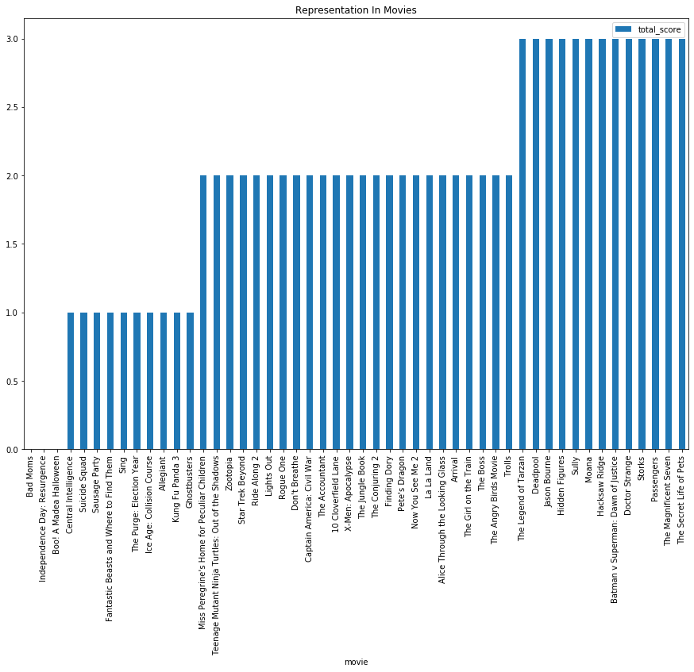
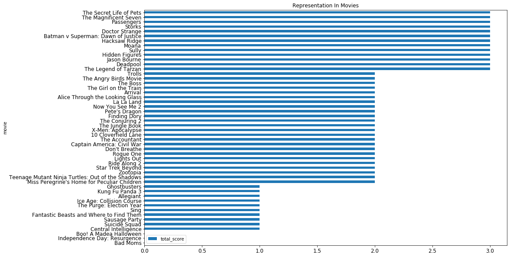

# Project: Visualizing Race and Gender Representation In American Movies

In this project you'll use data visualization techniques to analyze how the top 50 movies of 2016 performed according to the <a href = "https://en.wikipedia.org/wiki/Bechdel_test" target="_blank"> Bechdel Test </a>and other representation-based tests. 

**The Bechdel-Wallace Test** — often abbreviated to the "Bechdel Test" — evaluates movies based on two simple questions:

  1.  Does the movie have at least two named female characters?
  2.  And do those characters have at least one conversation that is not about a man?

To perform your visualization, you'll use a dataset called  "The Next Bechdel Test" from <a href="https://www.fivethirtyeight.com" target="_blank">fivethirtyeight.com</a>. You can read more about the dataset at the following link:

<a href = "https://projects.fivethirtyeight.com/next-bechdel/" target="_blank">The Next Bechdel Test </a>


  
In addition to results of the Bechdel test, this dataset includes the results of similar representation tests developed by members of the movie industry and evaluated by <a href = "http://fivethirtyeight.com" target="_blank">fivethirtyeight.com. </a>

**The Waithe Test** (Lena Waithe)

A movie passes if:
- There's a black woman in the work
- Who's in a position of power
- And she's in a healthy relationship

**The Ko Test** (Naomi Ko)

A movie passes if:
- There's a non-white, female-identifying person in the film
- Who speaks in five or more scenes
- And speaks english


## 1. SETUP

Import matplotlib.pyplot as plt and pandas as pd.


```python
import pandas as pd
from matplotlib import pyplot as plt
```

Use Pandas `pd.read_csv()` to load the dataset **bechdelExpanded.csv** into a DataFrame and save the results to a variable. You can name the variable anything you like. `df` is often used as the variable name for a DataFrame.


```python
df = pd.read_csv('bechdelExpanded.csv')
```

## 2. Learn About Your Data

Inspect the DataFrame using `.head()`

The first column in the dataset is the name of a movie. Each column that follows represents one of the tests being applied to each movie. Each row represents whether that movie passed, or failed each test. A `1` represents a passing score, and a `0` represents a failing score.


```python
print(df.head())
```

                              movie  bechdel  peirce  landau  feldman  villareal  \
    0                      Bad Moms        0       0       0        1          0   
    1                Hidden Figures        1       0       0        0          0   
    2  Independence Day: Resurgence        0       0       1        0          0   
    3                  Finding Dory        0       0       1        0          0   
    4                  Ghostbusters        0       0       0        0          0   
    
       hagen  ko  villarobos  waithe  koeze_dottle  uphold  white  rees-davies  
    0      0   0           1       0             0       1      1            1  
    1      1   1           1       1             1       1      1            1  
    2      1   0           1       0             0       1      1            1  
    3      0   1           1       1             1       1      1            0  
    4      1   0           1       1             1       1      1            1  
    

Call `.info()` on your DataFrame and print the result. This will display a summary of the basic information about your DataFrame and its data.


```python
print(df.info())
```

    <class 'pandas.core.frame.DataFrame'>
    RangeIndex: 50 entries, 0 to 49
    Data columns (total 14 columns):
    movie           50 non-null object
    bechdel         50 non-null int64
    peirce          50 non-null int64
    landau          50 non-null int64
    feldman         50 non-null int64
    villareal       50 non-null int64
    hagen           50 non-null int64
    ko              50 non-null int64
    villarobos      50 non-null int64
    waithe          50 non-null int64
    koeze_dottle    50 non-null int64
    uphold          50 non-null int64
    white           50 non-null int64
    rees-davies     50 non-null int64
    dtypes: int64(13), object(1)
    memory usage: 5.6+ KB
    None
    

## 3. Data Manipulation
Create a column for total_score and set the value of each of its entries equal to the sum of the three columns: bechdel, waithe, ko. This will give us the total score each movie received based on these three tests.


```python
df['total_score'] = df.apply(lambda row: row.bechdel + row.waithe + row.ko , axis=1)
```

Check your DataFrame again with `.head()` to see the new column.


```python
print(df.head())
```

                              movie  bechdel  peirce  landau  feldman  villareal  \
    0                      Bad Moms        0       0       0        1          0   
    1                Hidden Figures        1       0       0        0          0   
    2  Independence Day: Resurgence        0       0       1        0          0   
    3                  Finding Dory        0       0       1        0          0   
    4                  Ghostbusters        0       0       0        0          0   
    
       hagen  ko  villarobos  waithe  koeze_dottle  uphold  white  rees-davies  \
    0      0   0           1       0             0       1      1            1   
    1      1   1           1       1             1       1      1            1   
    2      1   0           1       0             0       1      1            1   
    3      0   1           1       1             1       1      1            0   
    4      1   0           1       1             1       1      1            1   
    
       total_score  
    0            0  
    1            3  
    2            0  
    3            2  
    4            1  
    

## 4. Sorting Data

It will be easier to visualize our data if it is organized by each movie's total score.  

Using Pandas `.sort_values()`, create a new DataFrame called `df_sorted` that is a copy of your current DataFrame, sorted by `total_score`. Make sure to reset the index of the new DataFrame using `.reset_index(drop = True)`.

Hint: The syntax for sorting by a column in Pandas is:
`df.sort_values("column_name").reset_index(drop = True)`


```python
df_sorted = df.sort_values("total_score").reset_index(drop = True)
```

Use .head() to check your new `df_sorted` DataFrame.


```python
print(df_sorted.head())
```

                              movie  bechdel  peirce  landau  feldman  villareal  \
    0                      Bad Moms        0       0       0        1          0   
    1  Independence Day: Resurgence        0       0       1        0          0   
    2        Boo! A Madea Halloween        0       0       1        1          1   
    3          Central Intelligence        1       0       1        1          1   
    4                 Suicide Squad        0       0       1        1          1   
    
       hagen  ko  villarobos  waithe  koeze_dottle  uphold  white  rees-davies  \
    0      0   0           1       0             0       1      1            1   
    1      1   0           1       0             0       1      1            1   
    2      1   0           1       0             0       1      1            1   
    3      1   0           1       0             1       1      1            1   
    4      1   0           1       1             1       1      1            0   
    
       total_score  
    0            0  
    1            0  
    2            0  
    3            1  
    4            1  
    

## 5. Isolating the Data
For this project, we have selected three of the representation tests to focus on. To make it easier for us to look at the relevant data, create a new DataFrame containing only the columns 'movie', 'bechdel', 'waithe', 'ko', 'total_score' from the `df_sorted` DataFrame.


```python
df_partial = df_sorted[['movie', 'bechdel', 'waithe', 'ko', 'total_score']]
```

Use .head() to check the new DataFrame.


```python
print(df_partial.head())
```

                              movie  bechdel  waithe  ko  total_score
    0                      Bad Moms        0       0   0            0
    1  Independence Day: Resurgence        0       0   0            0
    2        Boo! A Madea Halloween        0       0   0            0
    3          Central Intelligence        1       0   0            1
    4                 Suicide Squad        0       1   0            1
    

## 6. Plot DataFrame with Matplotlib


Next,  use Pandas to create a new DataFrame using only the data you want to use in a plot. Then, create a bar chart with that data using Matplotlib.


**6.A**

Using `[[]]` notation, select the columns `movie` and `total_score` from the DataFrame `df_partial`, then using `.set_index()`, set the `index` to the columns `movie`, and save it all to a variable named `ax`.


```python
ax = df_partial[['movie','total_score']].set_index('movie')
```

**6.B**

Create a plot of the `ax` DataFrame with the Matplotlib method `.plot()`. Include the following arguments inside of `.plot()` . You can change these on your own and run the plot again if you would like.
- `kind = 'bar'`
- `title ='Representation In Movies'`
- `figsize=(15, 10)`
- `legend=True`


```python
ax.plot(kind = 'bar',
       title ='Representation In Movies',
       figsize=(15, 10),
       legend=True)
```


    <matplotlib.axes._subplots.AxesSubplot at 0x2171f676f48>





## 7. Iterate and Discover Meaning

There are many aspects of a Matplotlib plot that can be customized to make it easier to visualize data. Try a few of them below:

Set the `kind` argument of `.plot()` to `barh` to make the plot a horizontal bar chart.

Add the following argument to `.plot()` so it is easier to see the names of each movie: `fontsize=12`.

Make the visualization taller, and even the spread by changing the figsize argument to `figsize=(15, 15)`.


```python
ax.plot(kind = 'barh',
       title ='Representation In Movies',
       figsize=(15, 10),
       legend=True, fontsize=12)
```


    <matplotlib.axes._subplots.AxesSubplot at 0x2171e042d88>





## You're done! 

Feel free to use this notebook to continue experimenting. 

---
